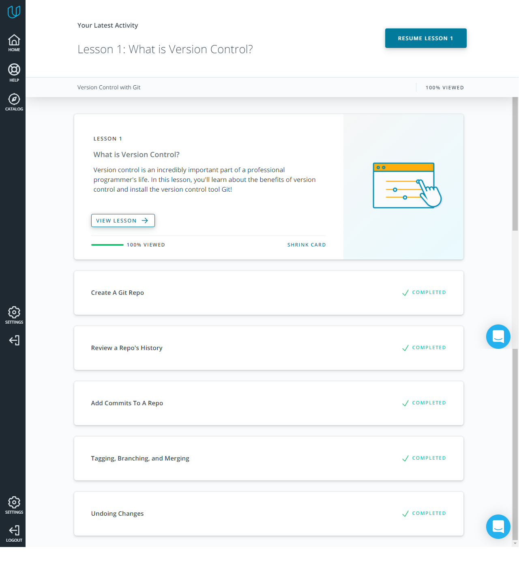
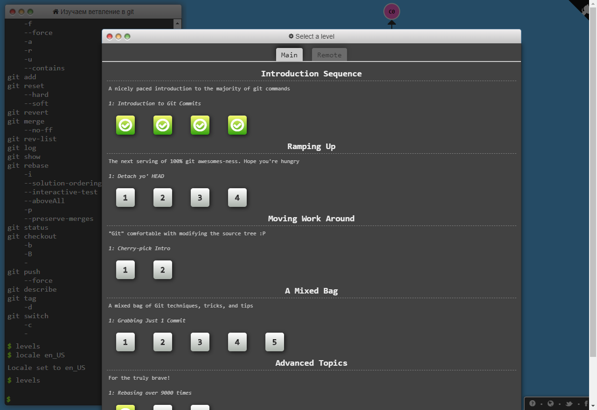

2.Git Basics 
=================
New to me: 
 + There are three main VCS (Version Control System). 
 + Git, Subversion, Mercurial. 
	
Surprise me: 
 + Two categories of VCS: Centralized and Distributed. 
 + Status of the document in Google Documents is a link with 
different versions of document. 

I intend to use in the future: 
 - EVERYTHING

