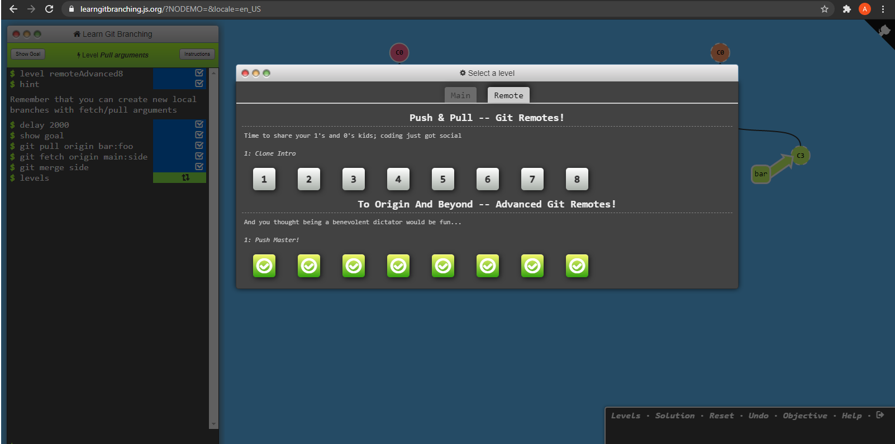
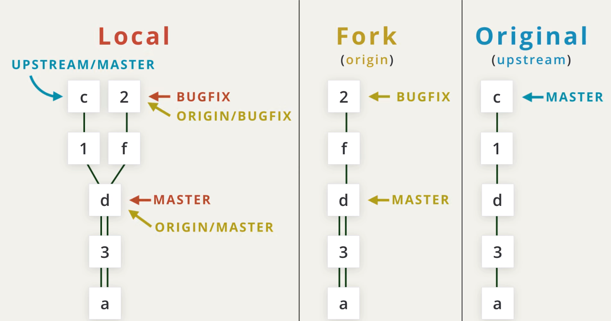

- [x] Git Basics
- [x] Linux CLI and Networking
- [x] VCS (hello gitty), GitHub and Collaboration
- [ ] Front-End Basics
- [ ] Intro to HTML & CSS
- [ ] Responsive Web Design
- [ ] HTML & CSS Practice
- [ ] JavaScript Basics
- [ ] Document Object Model - practice
- [ ] Advanced Topics
- [ ] Building a Tiny JS World (pre-OOP) - practice
- [ ] Object oriented JS - practice
- [ ] OOP exercise - practice
- [ ] Offline Web Applications
- [ ] Memory pair game — real project!
- [ ] Website Performance Optimization
- [ ] Friends App - real project!

0.Git Basics 
=================

New to me: 
 + There are three main VCS (Version Control System): 
Git, Subversion, Mercurial. 
	
Surprise me: 
 + Two categories of VCS: Centralized and Distributed. 
 + Status of the document in Google Documents is a link with 
different versions of document. 

I intend to use in the future: 
 - EVERYTHING

<strong>Screeenshots</strong>

1.Linux CLI, HTTP 
=================

New to me: 
 + GET: fetch an existing resource. The URL contains all the necessary information the server needs to locate  
and return the resource. 

 + POST: create a new resource. POST requests usually carry a payload that specifies the data for the new resource. 

 + PUT: update an existing resource. The payload may contain the updated data for the resource. 
 + DELETE: delete an existing resource. 

 + Post = Put + Delete (sometimes) 

 + HEAD: this is similar to GET, but without the message body. It's used to retrieve the server headers  
for a particular resource, generally to check if the resource has changed, via timestamps. 

 + TRACE: used to retrieve the hops that a request takes to round trip from the server. Each intermediate  
proxy or gateway would inject its IP or DNS name into the Via header field. This can be used for diagnostic  
purposes. 

 + OPTIONS: used to retrieve the server capabilities. On the client-side, it can be used to modify the request  
based on what the server can support. 

 + In HTTP/1.0, all connections were closed after a single transaction. So, if a client wanted to request  
three separate images from the same server, it made three separate connections to the remote host. 

 + To reduce connection-establishment delays, HTTP/1.1 introduced persistent connections, long-lived connections  
that stay open until the client closes them. 
	
Surprise me: 
 + Post = Put + Delete (sometimes) 

I intend to use in the future: 
 - EVERYTHING 

<strong>Screeenshots</strong>

 

2.GitHub and Collaboration 
=================

New to me: 

 - $ git shortlog  --  A quick way that we can see how many commits each contributor has added to the repository 
 
 - $ git shortlog -s -n  -- to see just the number of commits that each developer has made, we can add a couple  
of flags: -s to show just the number of commits (rather than each commit's message) and -n to sort them numerically 
 
 - $ git log --author=Surma  -- display all of the commits by an author 
 - $ git log --author="Paul Lewis" 
 
 - $ git log --grep=bug  -- filter down to just the commits that reference the word "bug" 
 - $ git log --grep="border radius issue in Safari" 
 
To make a PR: 
	+ you must fork the source repository 
	+ clone your fork down to your machine 
	+ make some commits (ideally on a topic branch!) 
	+ push the commits back to your fork 
	+ create a new pull request and choose the branch that has your new commits 
 

 - What might be confusing is that origin does not refer to the source repository (also known as the "original"  
repository) that we forked from. Instead, it's pointing to our forked repository. So even though it has the  
word origin is not actually the original repository. 
 
 - $ git remote add upstream https://github.com/udacity/course-collaboration-travel-plans.git 
 
 - $ git remote -v 
 
 - $ git fetch upstream master 
 
 - $ git rebase -i HEAD~3  -- Если нужно "объеденить n коммита в один", то количество "объединенных" коммитов  
равняется числу(n) после ~(n). Чтобы сохранить эти 3 коммита - можно создать ветку "backup"  
($ git branch backup),а потом объединять. 
 
 - $ git checkout -b foo o/main -- We will checkout a new branch named foo and set it to track main on the remote. 
or 
 - $git branch -u o/main foo 
 
 - $ git push origin main  -- запушили main в origin  
 
 - $ git push origin <source>:<destination> == git push origin foo^:main --можно пушить одну ветку в другую,даже с другим именем 
(if the destination you want to push doesn't exist - give a branch name and git will create the branch on the remote). 
 
 - $ git fetch origin foo~1: bar -- тоже самое, что и push  
(if the destination doesn't exist - Git made the destination locally before fetching) - как и в push  
 
 - $ git push origin :foo  -- delete foo 
 
 - & git fetch origin :bar  -- make a new branch 
 
Surprise me: 
- $ git push origin :foo  -- delete foo 
 
 - & git fetch origin :bar  -- make a new branch 

I intend to use in the future: 
 - EVERYTHING 

<strong>Screeenshots</strong>

 

