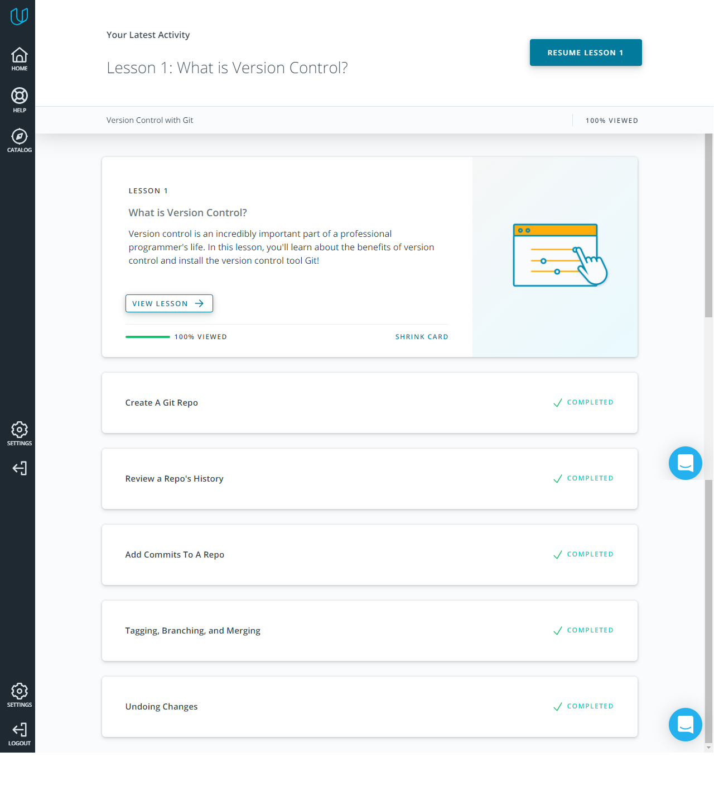
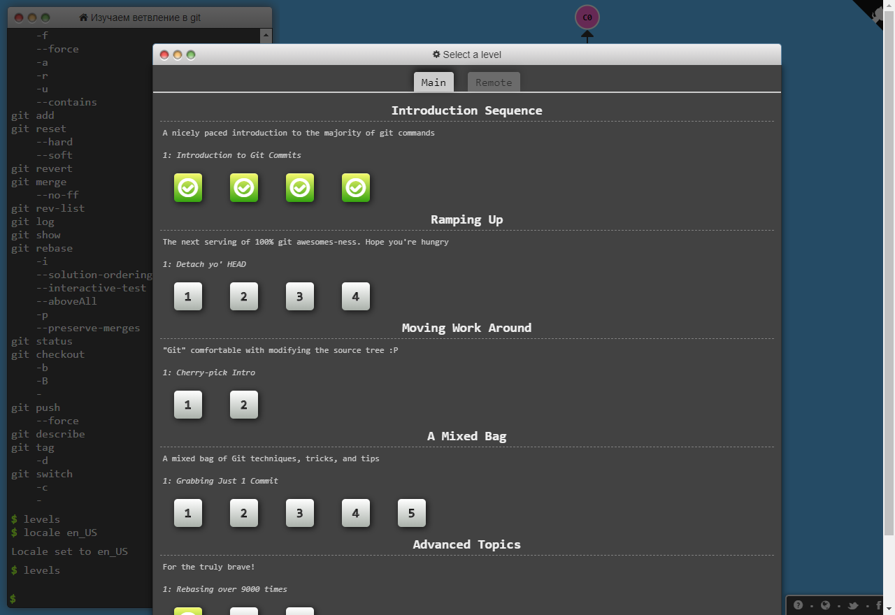
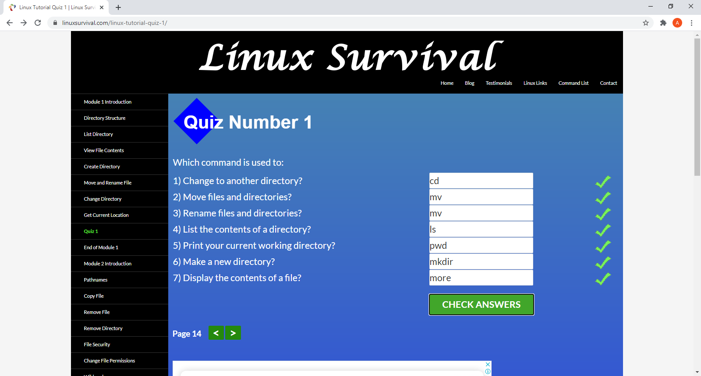
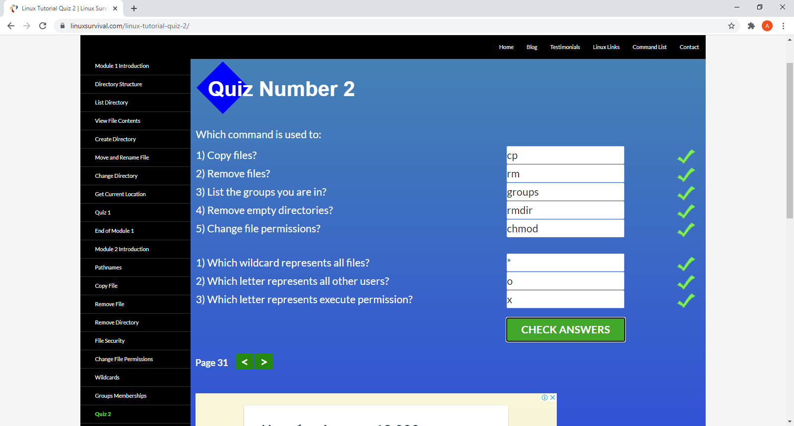
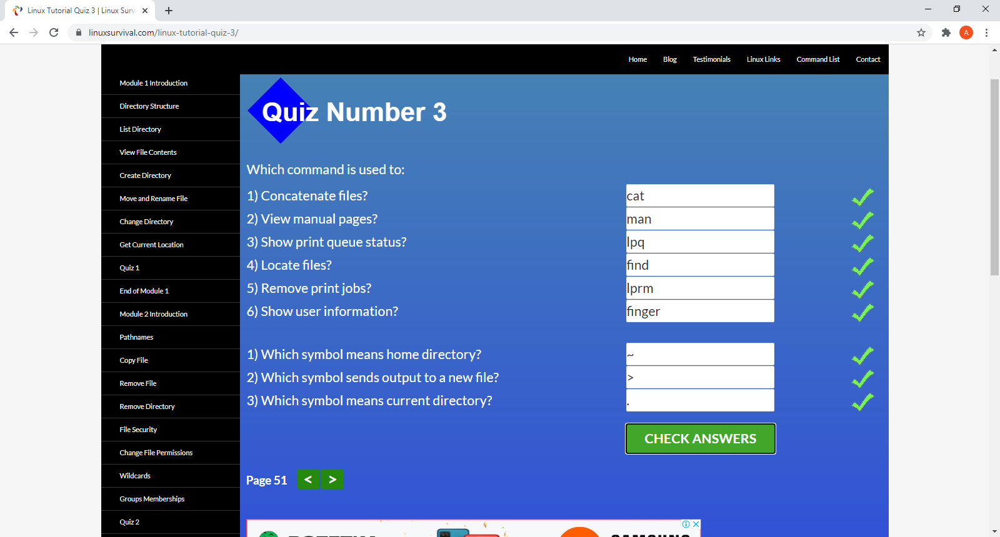
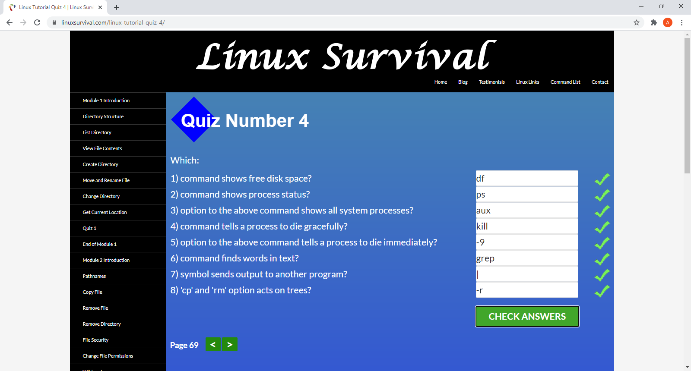

- [x] Git Basics
- [x] Linux CLI and Networking
- [ ] VCS (hello gitty), GitHub and Collaboration
- [ ] Front-End Basics
- [ ] Intro to HTML & CSS
- [ ] Responsive Web Design
- [ ] HTML & CSS Practice
- [ ] JavaScript Basics
- [ ] Document Object Model - practice
- [ ] Advanced Topics
- [ ] Building a Tiny JS World (pre-OOP) - practice
- [ ] Object oriented JS - practice
- [ ] OOP exercise - practice
- [ ] Offline Web Applications
- [ ] Memory pair game — real project!
- [ ] Website Performance Optimization
- [ ] Friends App - real project!

# 0.Git Basics

New to me: 
 + There are three main VCS (Version Control System). 
 + Git, Subversion, Mercurial. 
	
Surprise me: 
 + Two categories of VCS: Centralized and Distributed. 
 + Status of the document in Google Documents is a link with 
different versions of document. 

I intend to use in the future: 
 - EVERYTHING

1.Linux CLI, HTTP 
=================
New to me: 
GET: fetch an existing resource. The URL contains all the necessary information the server needs to locate  
and return the resource. 

POST: create a new resource. POST requests usually carry a payload that specifies the data for the new resource. 

PUT: update an existing resource. The payload may contain the updated data for the resource. 
DELETE: delete an existing resource. 

Post = Put + Delete (sometimes) 

HEAD: this is similar to GET, but without the message body. It's used to retrieve the server headers  
for a particular resource, generally to check if the resource has changed, via timestamps. 

TRACE: used to retrieve the hops that a request takes to round trip from the server. Each intermediate  
proxy or gateway would inject its IP or DNS name into the Via header field. This can be used for diagnostic  
purposes. 

OPTIONS: used to retrieve the server capabilities. On the client-side, it can be used to modify the request  
based on what the server can support. 

In HTTP/1.0, all connections were closed after a single transaction. So, if a client wanted to request  
three separate images from the same server, it made three separate connections to the remote host. 

To reduce connection-establishment delays, HTTP/1.1 introduced persistent connections, long-lived connections  
that stay open until the client closes them. 
	
Surprise me: 
 + Post = Put + Delete (sometimes) 

I intend to use in the future: 
 - EVERYTHING

